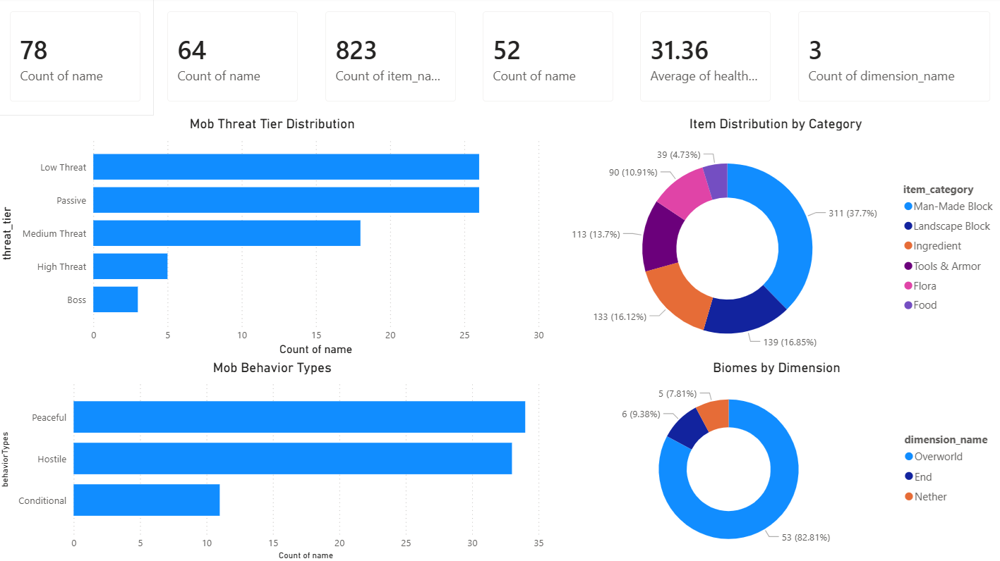
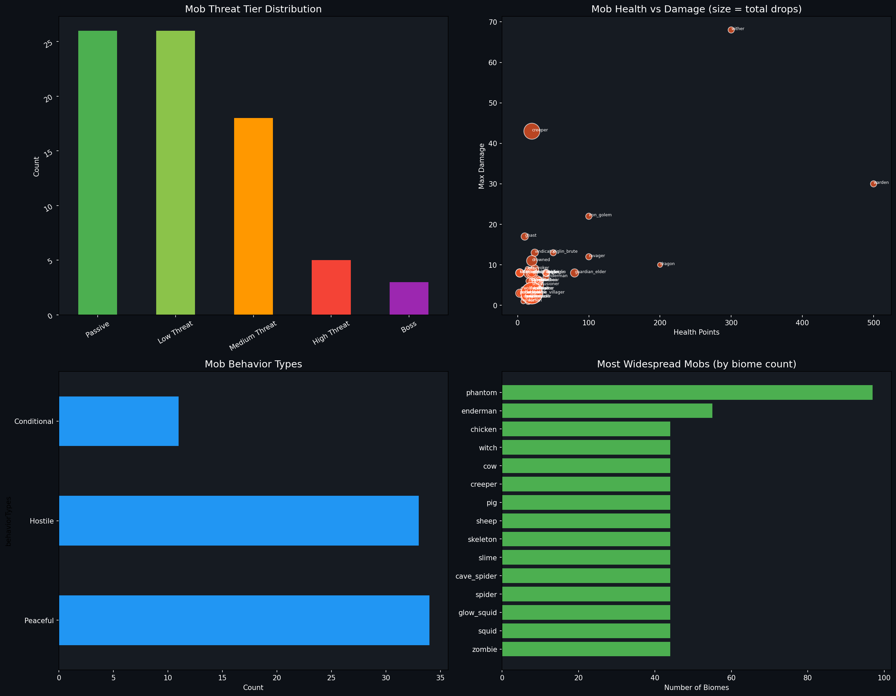
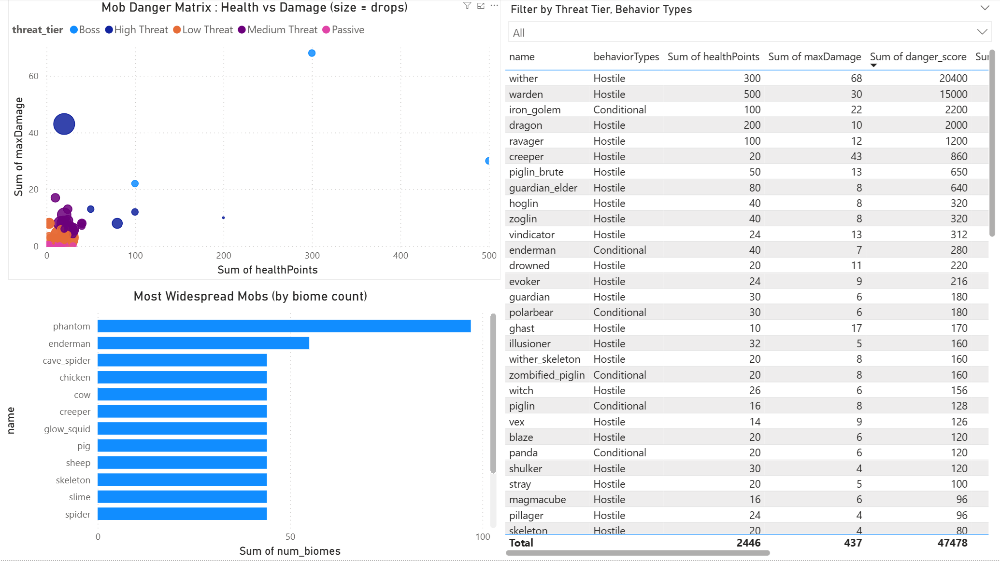
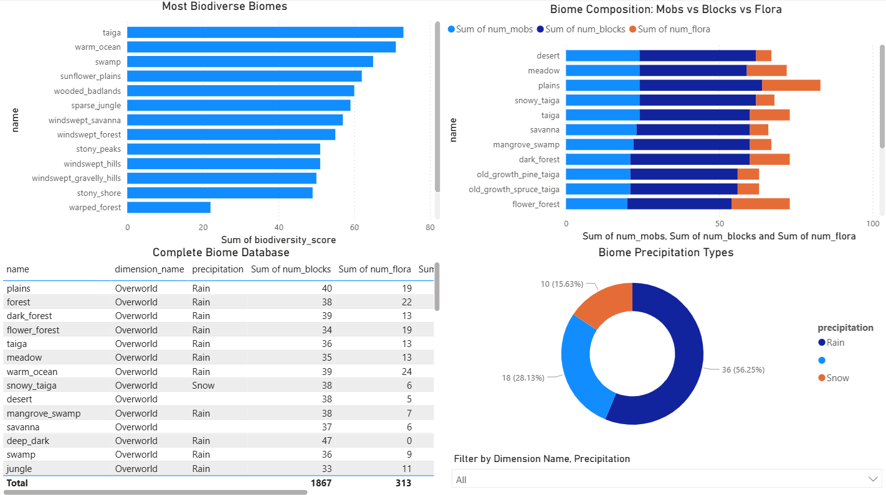
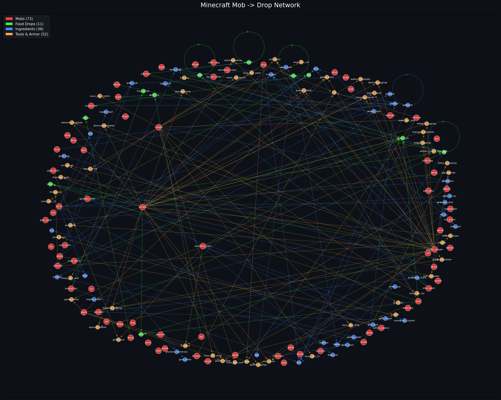

# ⛏️ Minecraft Encyclopedia - Game Data Analysis & Dashboard

A comprehensive analysis of Minecraft's game data covering **78 mobs**, **64 biomes**, and **823 items** featuring Python network analysis of mob-drop relationships, a biodiversity scoring system for biomes and a 4-page interactive Power BI dashboard.



## PROJECT OVERVIEW

Minecraft's game systems are deceptively complex as mobs spawn in specific biomes, drop specific items and those items feed into a vast crafting network. This project brings data analysis to the world of Minecraft by:

1. **Python Analysis** - enriching raw relational data with calculated metrics (danger scores, biodiversity indexes, drop counts) and building a network graph of mob-drop relationships
2. **Power BI Dashboard** - a 4-page interactive explorer covering mobs, biomes, items and the full game encyclopedia

## KEY FINDINGS

### Mob Ecosystem
- **78 total mobs** split across three behavior types: **Peaceful (30)**, **Hostile (30)**, and **Conditional (12)** - a remarkably even split between friendly and dangerous creatures
- **The Wither is the most dangerous mob** with a danger score of 20,400 (300 HP × 68 damage), followed by the Warden at 15,000 - both are intentionally designed as endgame challenges
- **Phantoms are the most widespread mob**, spawning in nearly 100 biomes reflecting their unique mechanic of spawning based on player insomnia rather than biome type
- **Endermen** are the second most widespread, appearing in ~45 biomes across both Overworld and End dimensions fitting their interdimensional lore
- The mob danger matrix reveals a clear **design cluster**: most hostile mobs cluster around 20-100 HP and 5-15 damage, with only boss-tier mobs (Wither, Warden, Dragon) as extreme outliers

### Biome Diversity
- **64 biomes** across 3 dimensions: **Overworld (53, 82.81%)**, **Nether (6, 9.38%)**, and **End (5, 7.81%)**
- **Taiga is the most biodiverse biome** with the highest combined biodiversity score (mobs + blocks + flora) followed by Warm Ocean and Swamp
- **Desert and Meadow** lead in block variety, while **Plains** has the most balanced composition across all three categories
- **56.3% of biomes have rain**, 28.1% have no precipitation, and 15.6% have snow creating a natural climate gradient across the Overworld
- The composition breakdown reveals that **blocks dominate biome content** (averaging 30+ per biome), while flora is much sparser (5-24 per biome), blocks are the building blocks of Minecraft's world

### Item Encyclopedia
- **823 total items** across 6 categories: **Man-Made Blocks (311, 37.7%)** dominate, followed by **Landscape Blocks (139, 16.85%)**, **Ingredients (133, 16.12%)**, **Tools & Armor (113, 13.7%)**, **Flora (90, 10.91%)** and **Food (39, 4.73%)**
- **Netherite tools are the most durable** at ~2,031 durability each significantly outperforming diamond tools (~1,561) by about 30%
- **Rabbit Stew** is the best food item, restoring the most hunger (10), followed by Cooked Beef and Cooked Porkchop (8 each)
- The items-per-version chart shows a massive spike at version 1.0 (the original release) with content additions becoming more incremental in later versions

### Mob-Drop Network
- The network graph reveals **73 mobs** connected to **11 food drops**, **36 ingredients**, and **52 tools/armor** through **201 drop relationships**
- Some items are dropped by many different mobs (shared drops like bones, string), while others are exclusive to a single mob (unique drops) this creates both common resources and rare farming targets
- Hostile mobs generally have more diverse drop tables than peaceful mobs, incentivizing combat engagement



## DASHBOARD PAGES

### Page 1: Overview
KPI cards (78 mobs, 64 biomes, 823 items, 52 hostile, avg HP 31.36, 3 dimensions), threat tier distribution, item categories, mob behavior types, biomes by dimension

### Page 2: Mob Analysis
Health vs damage scatter plot with threat tier coloring, most widespread mobs by biome count, complete mob database table with danger scores and drop counts



### Page 3: Biome Explorer
Most biodiverse biomes ranking, biome composition breakdown (mobs vs blocks vs flora), complete biome database, precipitation type distribution

### Page 4: Item Catalog
Items by category and type, most durable tools and armor, food ranked by hunger restoration, items added per Minecraft version



## NETWORK ANALYSIS

The mob-drop network graph (generated with Python's NetworkX) visualizes the complete relationship between mobs and their drops:
- **Red nodes** = Mobs (73)
- **Green nodes** = Food drops (11)
- **Blue nodes** = Ingredients (36)
- **Orange nodes** = Tools & Armor (52)
- **Edges** = Drop relationships, colored by drop type



## TOOLS AND TECHNOLOGIES

- **Python** - data enrichment, network analysis, visualization
- **pandas** - data manipulation and relational joins across 15 tables
- **NetworkX** - graph analysis of mob-drop relationships
- **matplotlib / seaborn** - static visualizations
- **Power BI** - interactive 4 page dashboard
- **DAX** - calculated measures and aggregations

### Analytical Techniques Demonstrated
- Relational data joining (15 interconnected tables)
- Composite scoring (danger scores, biodiversity indexes)
- Network/graph analysis with NetworkX
- Multi-source data enrichment pipeline
- Interactive dashboard with cross-filtering

## PROJECT STRUCTURE

```
minecraft-encyclopedia-dashboard/
├── data/
│   ├── [15 original Kaggle CSVs]
│   ├── mobs_enriched.csv              # Enriched with drops, biomes, danger scores
│   ├── biomes_enriched.csv            # Enriched with biodiversity metrics
│   └── all_items_combined.csv         # Combined item catalog (825 items)
├── powerbi/
│   └── Minecraft_Encyclopedia.pbix    # Power BI dashboard
├── scripts/
│   └── prepare_and_analyze.py         # Data prep + network analysis + charts
├── images/                            # Network graph + dashboard screenshots
├── requirements.txt
└── README.md
```

## GETTING STARTED

### Prerequisites
- Power BI Desktop
- Python 3.10+

### Setup
```bash
git clone https://github.com/rush2pranav/minecraft-encyclopedia-dashboard.git
cd minecraft-encyclopedia-dashboard

pip install -r requirements.txt
python scripts/prepare_and_analyze.py

# Open powerbi/Minecraft_Encyclopedia.pbix in Power BI Desktop
```

### Dataset
Download from [Kaggle - Minecraft Blocks, Items, Mobs, Biomes](https://www.kaggle.com/datasets/madelinee/minecraft-blocks-items-mobs-biomes-etc) and place all CSV files in `data/`.

## WHAT I LEARNED

- **Relational data requires careful joining** Working with 15 interconnected tables and multiple join keys taught me the importance of tracking column names across merges and cleaning up duplicate keys, a real-world data engineering challenge.
- **Network analysis reveals hidden structure** The mob-drop network graph immediately shows patterns invisible in tables like which mobs share drops, which items are exclusive and how interconnected the farming ecosystem is. NetworkX made this visualization straightforward.
- **Composite scores make data comparable** Raw HP and damage numbers are hard to compare, but a "danger score" (HP × damage) instantly ranks all mobs on a single axis. Similarly, biodiversity scores make biomes comparable despite having very different compositions.
- **Combining Python and Power BI is powerful** Python handles the heavy data enrichment and network analysis, while Power BI provides the interactive exploration layer. Each tool plays to its strength.

## POTENTIAL EXTENSIONS

- Add crafting recipe network graph (items -> crafted items)
- Integrate Minecraft Wiki data for more detailed item stats
- Build a "Survival Guide" page recommending which biomes to target based on needed resources
- Add version over version analysis tracking how the game grew
- Create a "Farming Efficiency" calculator ranking mobs by drops per HP